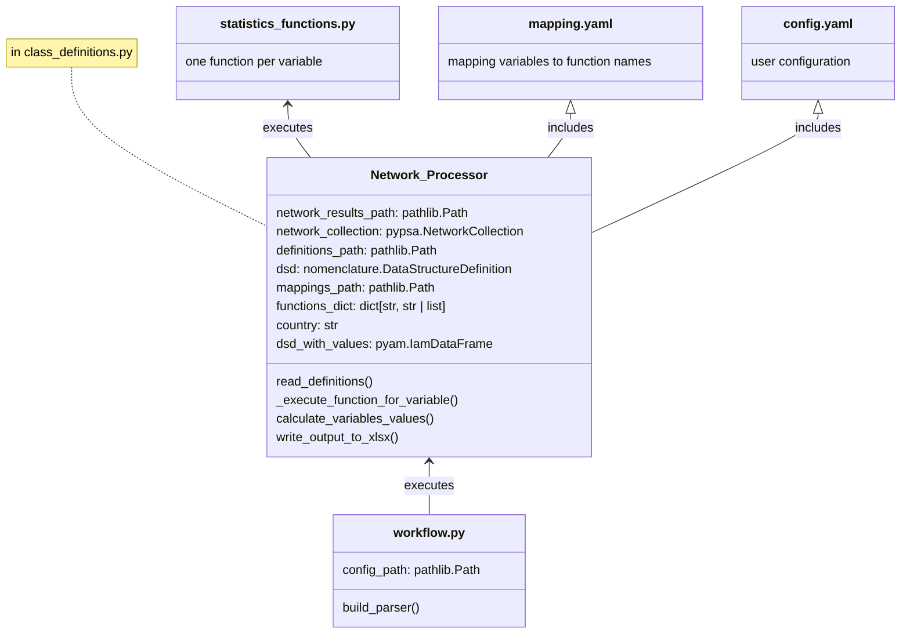

# Copilot Instructions

## Project Overview
This repository implements a reusable Python module (`pypsa_validation_processing`) that:
- Takes a definitions folder holding IAMC-formatted variable definitions
- Executes the corresponding function (if available) to extract the value of the respective variable from a given PyPSA NetworkCollection
- Returns the results as a `pyam.IamDataFrame`

## Code Structure



## Folder Structure

```
.gitignore
|- .github
|  `- copilot-instructions.md
|- pixi.toml
|- pyproject.toml
|- pypsa_validation_processing
|  |- configs
|  |  |- config.default.yaml
|  |  `- mapping.default.yaml
|  |- class_definitions.py
|  |- statistics_functions.py
|  `- workflow.py
|- workflow.py
|- resources
|- sister_packages
|- tests
|- README.md
`- LICENSE
```

## Key Conventions
- The main processing class `Network_Processor` lives in `pypsa_validation_processing/class_definitions.py`
- Statistics functions (one per IAMC variable) live in `pypsa_validation_processing/statistics_functions.py`
- The package workflow entrypoint is `pypsa_validation_processing/workflow.py`; the root `workflow.py` is a thin compatibility wrapper
- Default configs are packaged inside `pypsa_validation_processing/configs/`
- User/project configs also live in `configs/` at the project root (not versioned by default)
- The `resources/` directory holds versioned resources
- The `sister_packages/` directory holds related packages
- The `tests/` directory holds unit and integration tests
