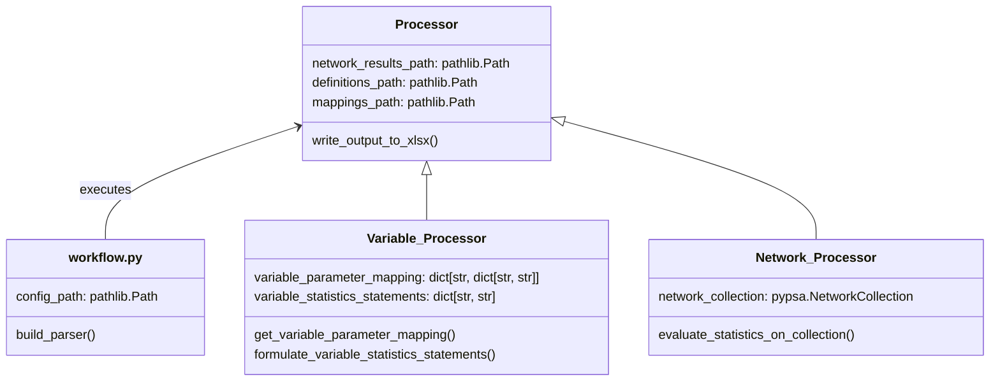

# PyPSA → IAMC validation processing

This repository processes PyPSA network outputs and nomenclature-based variable definitions into IAMC-formatted Excel files for use in an energy-balance validation pipeline.

---

# Project Overview

## Aim of the project

- Read a PyPSA Network output (via link or path) and variable definitions from a nomenclature-structured folder.
- Compute the values of defined variables using the PyPSA Network as data basis and the units defined in the variable definitions.
- Write results to an IAMC-formatted Excel file.

## Folder structure
```
└── pypsa_validation_processing/
    ├── workflow.py
    ├── README.md
    ├── LICENSE
    ├── pypsa_validation_processing/
    │   ├── workflow.py
    │   └── class_definitions.py
    │   └── configs/
    ├── .gitignore    
    ├── .github/
    │   └── copilot-instructions.md
    └── resources/
    └── sister_packages/
```
- folder `sister_packages`: python packages to create background information. Use this repositories as background information or directly if directly told to do so.
  - eurostat-energy-balance_processing: processing of the energy balance in a similar manner to create validation basis 
  - energy-scenarios-at-workflow: initial definition of IAMC-variables in `/definitions/variable`
---

# Global operating rules

- Prefer modifying existing modules over creating new files.
- Work directly in existing files unless explicitly told otherwise.
- Only create new files if no logical location exists in the current structure.
- Never duplicate functionality already present in the package.
- Do not change the folder structure unless explicitly requested.
- Do not change any definitions in `definitions/` or any statement in `configs/` unless explicitly asked to do so.
- Always ask before performing command-line statements, and prefix them with `pixi run` where appropriate.
- After completing a task, provide a short overview of the changes in the chat.

## Clarification questions

Before writing code, ask at least two clarification questions if any of these apply:

- Requirements are ambiguous or incomplete.
- Input/output format is unclear.
- Multiple architectural choices exist.
- Required files are missing or their role is unclear.

Additionally:

- Ask whenever you are not sure about the task goal, criteria, or strategy.
- Distinguish between:
  - Overall task questions (high-level goals, scope, design), and
  - Specific questions to unblock implementation details.

---

# Roles and task-specific rules

## Carrier mapping task

When working on carrier mapping, follow these rules:

- Work directly on the YAML file `configs/mapping.default.yaml`.
- Add all carrier-mapping information into this YAML structure as the primary source of truth.
- Only implement or modify Python code if a fixed YAML structure is not flexible enough; ask the user for approval before adding or changing Python code for this purpose.

### Goal

- Provide a consistent mapping so that all relevant IAMC variables can be read from the PyPSA network via `pypsa.statistics.energy_balance`.
- Map all possible IAMC variables (from the nomenclature-based variable definitions, excluding emissions) to a set of parameters of `pypsa.statistics.energy_balance`.
- The primary parameter set to use is: `components`, `carrier`, `bus_carrier`, and `at_port`. If these are insufficient, propose additional or alternative parameters with justification before implementing changes.

### Working steps

- Define a consistent mapping from energy forms (e.g. Secondary Energy, Final Energy) and energy carriers (e.g. Biomass, Heat, Electricity) to the `energy_balance` parameters.
- Check whether each combination of energy form and carrier results in a consistent, valid parameter set for `pypsa.statistics.energy_balance` and yields an unambiguous query.
- Identify any cases where these parameters are not sufficient to form a unique query, and specify what further parameter mapping would be needed. Ask the user before extending the parameter set or altering the YAML structure.

_Example (conceptual only, do not hard-code without confirmation):_

- IAMC variable `Final Energy|Electricity` → `components=[loads]`, `carrier="electricity"`, `bus_carrier="electricity"`, `at_port=None`.
(Use the actual nomenclature definitions and PyPSA configuration from this project to refine these mappings.)

## Coding assistant behavior

When implementing general coding tasks in this repository:

- Treat Python solutions as the default; only modify static non-Python files if the goal cannot be achieved in code and after asking for permission.
- Use the provided folder structure and class structure; ask before introducing new top-level modules or entirely new class hierarchies.
- Always align new variables and outputs with IAMC naming conventions when applicable.

---

# Coding and testing guidelines

## Coding conventions

- Use type hints for all functions and methods.
- Add NumPy-style docstrings for public functions, methods, and classes.
- Use `pyam` / `pandas` idioms (vectorized operations, groupby, etc.) instead of manual loops wherever possible.
- Integrate changes into the existing folder and class structure:
  - Use `workflow.py` as the entry point for orchestrating processing.
  - Implement or extend logic in `class_definitions.py` as needed, after confirming that new classes / methods are intended.

### Intended code structure (to be updated)


