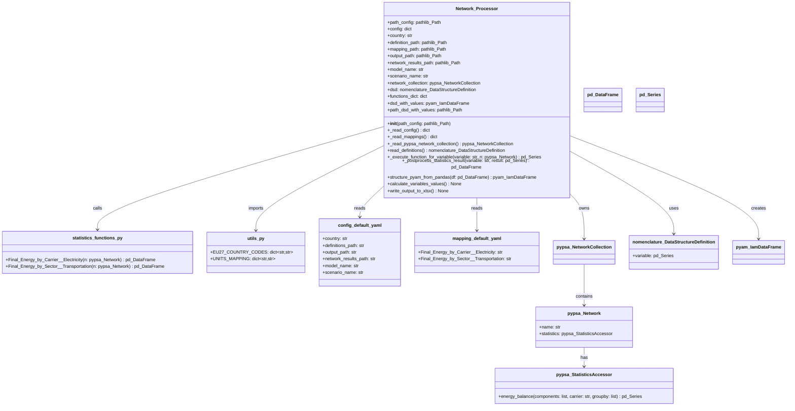

# Copilot Instructions

## Project Overview
This repository implements a reusable Python module (`pypsa_validation_processing`) that:
- Takes a definitions folder holding IAMC-formatted variable definitions
- Executes the corresponding function (if available) to extract the value of the respective variable from a given PyPSA NetworkCollection
- Saves the result as IAMC-formatted xlsx-file.

## Code Structure



## Folder Structure

```
.gitignore
|- .github
|  `- copilot-instructions.md
|- pixi.toml
|- pyproject.toml
|- pypsa_validation_processing
|  |- configs
|  |  |- config.default.yaml
|  |  `- mapping.default.yaml
|  |- class_definitions.py
|  |- statistics_functions.py
|  `- utils.py
|  `- workflow.py
|- workflow.py
|- resources
|- sister_packages
|- tests
|- README.md
`- LICENSE
```

## Key Conventions
- The main processing class `Network_Processor` lives in `pypsa_validation_processing/class_definitions.py`
- Statistics functions (one per IAMC variable) live in `pypsa_validation_processing/statistics_functions.py`
- `mapping.default.yaml` (or another mapping-file provided by the config-file) holds the mapping of IAMC variable to the respective function in `pypsa_validation_processing/statistics_functions.py`
- The package workflow entrypoint is `pypsa_validation_processing/workflow.py`; the root `workflow.py` is a thin compatibility wrapper
- Default configs are packaged inside `pypsa_validation_processing/configs/`
- Pixi is used as environment package manager. Use `pixi run` before your statement in cli to use the intended pixi-environment.
- The `resources/` directory holds non-versioned resources
- The `sister_packages/` directory holds related packages for background information
- The `tests/` directory holds unit and integration tests

## Task Completion Criteria
A task is complete when:
- Code runs without syntax errors.
- Tests pass or new tests are added and pass.
- New variables follow IAMC naming conventions.
- Changes are integrated into existing folder structure.
- A short summary of changes is provided.
- In chat mode: the user has reviewed the changes and given approval.
- For a pull-request: the user is reviewer of the pull request to give approval.

## Forbidden Actions
- Do NOT invent datasets, files, or APIs.
- Do NOT assume undocumented variables exist.
- Do NOT change any definitions in `definitions/`, or any statement in `configs/` unless explicitly asked for.
- Do NOT change folder structure unless explicitly requested.
- Do NOT change copilot-instructions.md unless explicitly requested.

## Testing Rules
- Add or update tests when behavior changes.
- Tests belong only in `/tests`.
- Prefer minimal unit tests over integration tests.
- all testing routines `test_statistics_functions.py` for functions in `statistics_functions.py` must test the output-format. The outputformat MUST be a pandas.Series with Multiindex of ``country`` and ``unit``. It CAN include more levels in the Multiindex.

## Background Information
> [!WARNING]
> External documentation provides semantic guidance only. Local project conventions override external documentation.

- nomenclature-package: https://nomenclature-iamc.readthedocs.io/en/stable/
- pyam-package: https://pyam-iamc.readthedocs.io/en/stable/
- IAMC-format naming conventions: https://docs.ece.iiasa.ac.at/standards/variables.html
- pypsa StatisticsAccessor: https://docs.pypsa.org/latest/api/networks/statistics/#pypsa.Network.statistics
- pypsa Documentation: https://docs.pypsa.org/latest/

