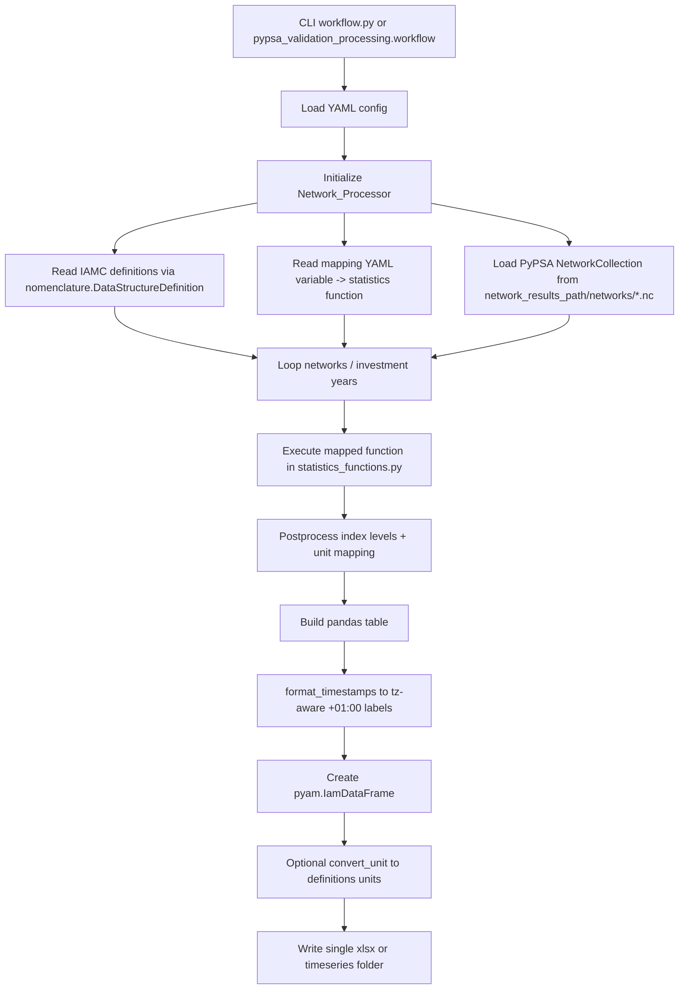

# Copilot Instructions

## Project Overview
This repository provides the Python package `pypsa_validation_processing`, which extracts IAMC variables from a PyPSA `NetworkCollection` and writes IAMC-formatted Excel output.

## Processing Flow

```mermaid
flowchart TD
    A[CLI workflow.py or pypsa_validation_processing.workflow] --> B[Load YAML config]
    B --> C[Initialize Network_Processor]
    C --> D[Read IAMC definitions via nomenclature.DataStructureDefinition]
    C --> E[Read mapping YAML variable -> statistics function]
    C --> F[Load PyPSA NetworkCollection from network_results_path/networks/*.nc]
    D --> G[Loop networks / investment years]
    E --> G
    F --> G
    G --> H[Execute mapped function in statistics_functions.py]
    H --> I[Postprocess index levels + unit mapping]
    I --> J[Build pandas table]
    J --> K[format_timestamps to tz-aware +01:00 labels]
    K --> L[Create pyam.IamDataFrame]
    L --> M[Optional convert_unit to definitions units]
    M --> N[Write single xlsx or timeseries folder]
```

## Key Implementation Notes
- Main class: `pypsa_validation_processing/class_definitions.py::Network_Processor`
- Workflow entrypoint: `pypsa_validation_processing/workflow.py`
- Root `workflow.py` is only a compatibility wrapper.
- Statistics functions are discovered dynamically from mapping names in `statistics_functions.py`.

### Config behavior currently implemented
The packaged default config is in `pypsa_validation_processing/configs/config.default.yaml`.

Relevant keys:
- `country`: ISO alpha-2 code (e.g. `AT`) or `all`
- `definitions_path`: path to IAMC definitions
- `convert_units`: bool (default `true`) to convert output units to definitions units
- `mapping_path`: optional override for variable-function mapping YAML
- `output_path`: base output directory
- `aggregation_level`: `country` or `region`
- `aggregate_per_year`: bool
- `map_country_codes_to_names`: bool (default `true`)
- `network_results_path`, `model_name`, `scenario_name`

### Output behavior
- `aggregate_per_year: true` writes one file.
- `aggregate_per_year: false` writes one folder and one file per investment year.
- Output file/folder names are sanitized (`_sanitize_path_token`) so whitespace becomes `_`.
- For `country: all`, filenames omit a country suffix.

### Aggregation behavior
- `aggregation_level: country`
  - `country: AT` -> sum AT* regions into one country row.
  - `country: all` -> sum per country prefix (`AT1 -> AT`, `DE2 -> DE`) and keep one row per country.
- `aggregation_level: region`
  - `country: AT` -> keep only matching AT* regions.
  - `country: all` -> keep all regions.

### Region naming behavior
- A `location` column is always used before creating `pyam.IamDataFrame`.
- If `map_country_codes_to_names` is `true`, region/country codes are mapped using `REGION_MAPPING` in `utils.py`.
- `REGION_MAPPING` merges country codes, special country-regions, and Austrian NUTS2/NUTS3 labels.

### Unit conversion behavior
- If `convert_units` is true, `Network_Processor` loads a common DSD from `definitions_path`.
- Each variable is converted via `pyam.IamDataFrame.convert_unit(current=..., to=...)` to the unit defined in the common DSD.
- Missing variable definitions or failed conversions raise errors.

### Time handling
- `format_timestamps(df)` converts time-like columns to timezone-aware timestamps with fixed `+01:00` before `pyam.IamDataFrame` construction.
- Year-only labels are interpreted as `YYYY-01-01 00:00:00+01:00`.

## Current mapped statistics functions
Defined in `pypsa_validation_processing/configs/mapping.default.yaml`:
- `Final Energy [by Carrier]|Electricity`
- `Final Energy [by Sector]|Transportation`
- `Final Energy [by Sector]|Industry`
- `Final Energy [by Sector]|Agriculture`

## Testing guidance
- Tests live under `tests/`.
- Before finalizing changes, run existing tests (prefer pixi when available):
  - `pixi run test`
  - fallback: `python -m pytest tests/ -v`
- Statistics-function tests must validate output format: pandas Series with MultiIndex including `location` and `unit` (additional levels allowed).

## Useful links
- Repository README: `README.md`
- IAMC naming conventions: https://docs.ece.iiasa.ac.at/standards/variables.html
- pyam docs: https://pyam-iamc.readthedocs.io/en/stable/
- nomenclature docs: https://nomenclature-iamc.readthedocs.io/en/stable/
- PyPSA statistics accessor docs: https://docs.pypsa.org/latest/api/networks/statistics/#pypsa.Network.statistics
