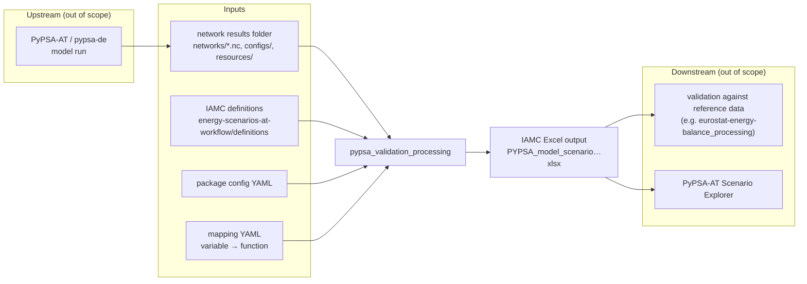

# Overview

Status: draft

## System context

Sources: `README.md`; `docs/index.md` ("Scenario Explorer"); `pypsa_validation_processing/class_definitions.py::Network_Processor`.

## Data flow
1. **Start.** `workflow.main` parses `--config` and `--log-level`, then creates `Network_Processor(config_path)` (`pypsa_validation_processing/workflow.py::main`). Without `--config`, the packaged `configs/config.default.yaml` is used (`get_default_config_path`).
2. **Initialisation.** `Network_Processor.__init__` reads and validates the config (C1, [configuration.md](configuration.md)), the mapping file (C4), the definitions (C3) and the network results folder (C2). All checks of [principles.md](constitution/principles.md) P5 happen here.
3. **Per investment year** (`calculate_variables_values`): for each network in the `pypsa.NetworkCollection`:
   1. Determine the investment year from `n.meta["wildcards"]["planning_horizons"]` and load the network config of that year (C2).
   2. Select the variables to evaluate (C3).
   3. For each variable, call its statistics function with `n` and the optional kwargs it declares (C5). Result: `pd.Series` or `pd.DataFrame` per C6.
   4. Post-process the result: aggregate or filter by `aggregation_level` and `country` (C8), normalise units via `UNITS_MAPPING` (C9), add the `variable` level.
4. **Assembly.**
   - `aggregate_per_year: true`: merge all years into one table with one column per investment year.
   - `aggregate_per_year: false`: keep one table per investment year; replace the snapshot year by the investment year (C10).
5. **Structuring** (`structure_pyam_from_pandas`): normalise timestamps, map region codes to names if configured, build a `pyam.IamDataFrame`, convert units to the definition units if configured (C9).
6. **Export** (`write_output_to_xlsx`): write `.xlsx` file(s) into `output_path` (C10).

## Components
| Component | Location | Responsibility |
|---|---|---|
| CLI / workflow | `pypsa_validation_processing/workflow.py` | Argument parsing, logging setup, orchestration. Root `workflow.py` is a compatibility wrapper only. |
| `Network_Processor` | `pypsa_validation_processing/class_definitions.py` | Config validation, input reading, function dispatch, aggregation, unit handling, pyam structuring, export. |
| `format_timestamps` | `pypsa_validation_processing/class_definitions.py` | Normalises column labels to integer years or UTC timestamps. |
| Statistics functions | `pypsa_validation_processing/statistics_functions.py` | One stand-alone function per IAMC variable (C5–C7). |
| Helpers and static data | `pypsa_validation_processing/utils.py` | Shared helpers for statistics functions; `UNITS_MAPPING`, `REGION_MAPPING`, `EU27_COUNTRY_CODES`, `statistics_kwargs*`. |
| Configs and mappings | `pypsa_validation_processing/configs/` | Packaged default config, example setups, mapping files. |
| Definitions | `sister_packages/energy-scenarios-at-workflow/definitions/` | IAMC variable names, units, regions (read-only). |

## Glossary
| Term | Meaning | Source |
|---|---|---|
| **Network** | One solved `pypsa.Network`, stored as one `.nc` file in `<network_results_path>/networks/`. One network corresponds to one investment year. Several networks are read together as a `pypsa.NetworkCollection`. | `Network_Processor._read_pypsa_network_collection`; https://docs.pypsa.org |
| **Investment year** | The planning horizon a network represents, e.g. 2030. Taken from `n.meta["wildcards"]["planning_horizons"]`, never from the file name. Used as the year column (yearly output) or the year of timestamps (time series output). | `Network_Processor.calculate_variables_values` |
| **Snapshot** | One time step of a network (`n.snapshots`). Snapshot timestamps carry a weather year that is not the investment year. | `calculate_variables_values` (year replacement); PyPSA docs |
| **Carrier** | PyPSA attribute naming the technology or energy type of a component, e.g. `CCGT`, `BEV charger`, `solar`. | `resources/carriers.csv`, `resources/carriers_bus_carriers_components.csv` |
| **Bus carrier** | Carrier of the bus a component connects to, e.g. `AC`, `low voltage`, `gas`, `co2`. Used as `bus_carrier` filter in `n.statistics`. | `resources/carriers_bus_carriers_components.csv` (column `bus_carrier`); PyPSA statistics docs |
| **Component** | PyPSA component class, e.g. `Generator`, `Link`, `Load`, `Line`, `Store`, `StorageUnit`. | `resources/carriers_bus_carriers_components.csv` (column `component`) |
| **Location** | Index level `location` of statistics results: the model region a value belongs to, e.g. `AT1`, `AT2`. Produced by `groupby=["location", "unit"]` in `n.statistics`. | `utils.statistics_kwargs`; `README.md` "Example output" |
| **Region** | A sub-national model region (a location value). Output granularity for `aggregation_level: region`. Codes MAY be mapped to names via `REGION_MAPPING` (NUTS2/NUTS3 names). | `Network_Processor._filter_to_regions`; `utils.REGION_MAPPING` |
| **Country** | ISO 3166-1 alpha-2 code (e.g. `AT`). The country of a location is its first two characters. Output granularity for `aggregation_level: country`. | `Network_Processor._aggregate_to_country`; [contracts.md](contracts.md) C1, C8 |
| **IAMC variable** | Hierarchical variable name with `|` separators, e.g. `Final Energy [by Carrier]|Electricity`, defined with a unit in the definitions. | `sister_packages/energy-scenarios-at-workflow/definitions/variable/*.yaml`; https://docs.ece.iiasa.ac.at/standards/variables.html |
| **Statistics function** | Function in `statistics_functions.py` that computes one IAMC variable from one network. | `README.md` "Variable's Statistics - Functions" |
| **Mapping file** | YAML file `<IAMC variable>: <function name>`. | `configs/mapping.default.yaml` |
| **Definitions** | Folder read by `nomenclature.DataStructureDefinition` with `variable/` and `region/` sub-folders. | `Network_Processor.read_definitions`; https://nomenclature-iamc.readthedocs.io/en/stable/ |
| **Network config** | The model config of one investment year, `<network_results_path>/configs/config*<year>.yaml`. Not the package config. | `Network_Processor._get_network_config` |
| **Package config** | The YAML file passed via `--config`; keys in [configuration.md](configuration.md). | `workflow.resolve_config_path` |
